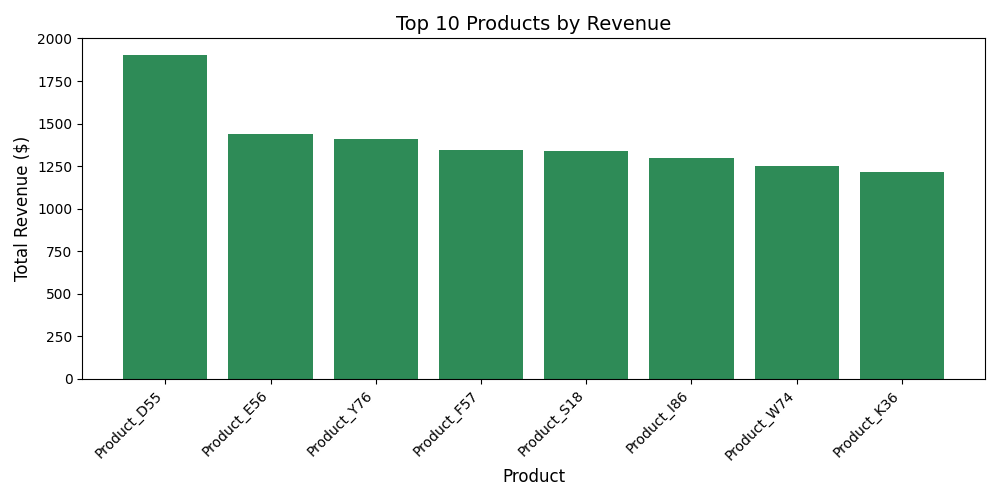

# 🏷️ Warehouse Sales Data Pipeline (DBT + DuckDB + Python)

This project demonstrates how to build a lightweight, modular data pipeline using [dbt](https://www.getdbt.com/) and [DuckDB](https://duckdb.org/) to analyze warehouse sales data. It includes a custom visualization built with Python and Pandas.

---

## 🔧 Tools & Technologies

- **dbt** for data modeling and transformations
- **DuckDB** as the embedded warehouse engine
- **Python** + Pandas + Matplotlib for visualization
- **GitHub** for version control and collaboration

---

## 📂 Project Structure


---

## 🔄 Data Flow Overview

1. **Raw CSVs** (inventory, products, sales) loaded into DuckDB as external sources.
2. **Staging Models** clean and standardize the data using dbt.
3. **Sales Summary Model** aggregates revenue and inventory data by product and warehouse.
4. **Python Script** creates a revenue chart using the summary.

---

## 📊 Top 10 Products by Revenue



---

## ▶️ How to Run

1. **Install Dependencies**
   ```bash
   pip install dbt-duckdb pandas matplotlib duckdb

